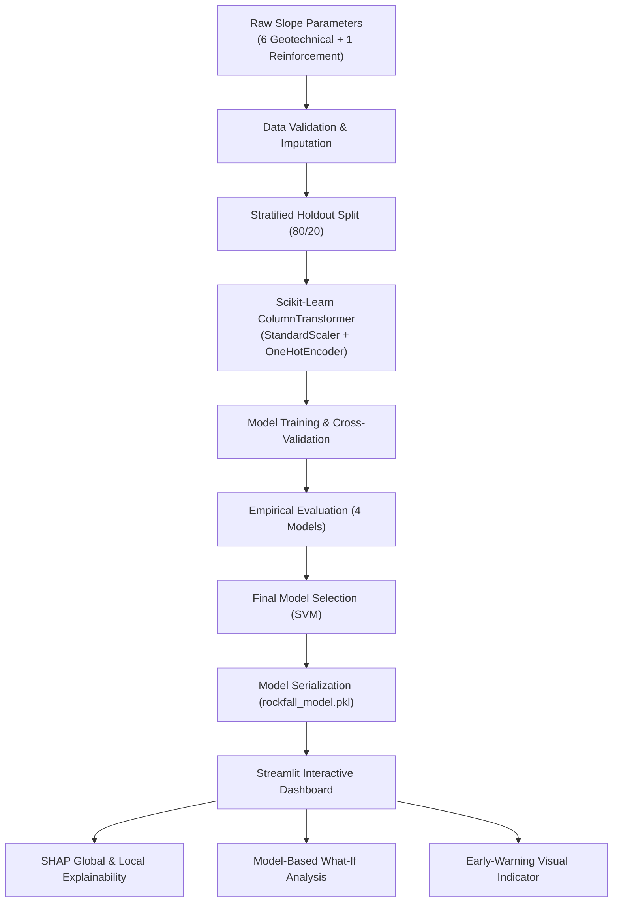

# Explainable AI-Based Rockfall Risk Prediction and Early Warning System for Open-Pit Mines

An end-to-end, reproducible Machine Learning and Explainable AI (XAI) application developed as an academic decision-support prototype for evaluating slope stability and screening rockfall risk in open-pit mining operations.

---

## 1. Project Overview
Rockfall and slope failures represent high-consequence geotechnical hazards in surface mining. This project delivers an automated risk classification, sensitivity simulation, and explainability dashboard that ingests geotechnical parameters, evaluates slope stability, issues early-warning risk indicators, and provides transparent feature attributions using SHAP (SHapley Additive exPlanations).

---

## 2. Problem Statement
In open-pit mine benches, slopes are continuously exposed to gravitational shear stresses, varying rock mass cohesion, pore water pressures, and blasting disturbances. Traditional limit-equilibrium analyses (such as Bishop, Janbu, or Spencer methods) require intensive geotechnical modeling and significant computation time. There is a pressing need for a rapid, data-driven machine learning screening tool capable of identifying high-risk slope conditions while providing transparent, physics-aligned explanations for geotechnical engineers.

---

## 3. Academic Objectives
* **Data Preprocessing & Leakage Prevention:** Construct a scikit-learn `ColumnTransformer` fitted strictly on training data to scale continuous features and encode support categories.
* **Target Formulation:** Derive ground-truth stability states from Factor of Safety ($FS < 1.0 \implies \text{Unstable Risk}$).
* **Multi-Model Benchmark:** Train and empirically evaluate 4 diverse classification algorithms: Logistic Regression, Support Vector Machine (SVM), Random Forest, and XGBoost.
* **Imbalance Handling:** Employ stratified partitioning and cost-sensitive class weighting to address the 33:1 stability-to-risk ratio.
* **Model Selection:** Select the deployment model prioritizing Recall and F1-score to prevent critical false-negative hazard omissions.
* **Explainable AI:** Deploy SHAP for global feature importance and single-instance local risk attributions.
* **Interactive Dashboard:** Build an 8-page Streamlit application featuring live inference, what-if sensitivity analysis, and early-warning alerts.

---

## 4. Dataset Description
* **File:** `dataset/slope_stability_dataset.csv`
* **Total Records:** 10,000 instances
* **Total Columns:** 9
* **Missing Values:** 0 (100% complete)
* **Duplicate Rows:** 0 (Unique cases)

### Feature Schema:
| Feature Name | Type | Physical Range | Units | Engineering Description |
| :--- | :---: | :---: | :---: | :--- |
| `Unit Weight (kN/m³)` | Numerical | 15.00 – 25.00 | $\text{kN/m}^3$ | Bulk unit weight of the slope rock/soil mass. |
| `Cohesion (kPa)` | Numerical | 5.01 – 50.00 | $\text{kPa}$ | Shear strength parameter resisting slip without normal stress. |
| `Internal Friction Angle (°)` | Numerical | 20.00 – 45.00 | degrees (°) | Angle of shearing resistance of the slope material. |
| `Slope Angle (°)` | Numerical | 10.00 – 59.99 | degrees (°) | Face inclination angle relative to the horizontal plane. |
| `Slope Height (m)` | Numerical | 5.00 – 50.00 | meters (m) | Vertical height from slope crest to toe. |
| `Pore Water Pressure Ratio` | Numerical | 0.00 – 1.00 | ratio ($r_u$) | Ratio of groundwater pore pressure to overburden stress. |
| `Reinforcement Type` | Categorical | 4 categories | — | Support measure: `Drainage`, `Geosynthetics`, `Retaining Wall`, `Soil Nailing`. |
| `Factor of Safety (FS)` | Target Proxy | 0.50 – 3.00 | ratio | Continuous stability factor (dropped from input features). |

---

## 5. Target Definition
The binary target is formulated according to fundamental geotechnical limit-equilibrium criteria:

$$\text{Risk Target} = (FS < 1.0) \implies \begin{cases} 1 & \text{RISK / UNSTABLE} \\ 0 & \text{STABLE} \end{cases}$$

* **Class 0 (STABLE):** 9,705 instances (**97.05%**)
* **Class 1 (RISK / UNSTABLE):** 295 instances (**2.95%**)

---

## 6. Architecture & Workflow


---

## 7. Machine Learning Models Evaluated
1. **Logistic Regression:** Linear baseline classifier using balanced class weighting (`class_weight='balanced'`).
2. **Support Vector Machine (SVM):** Non-linear RBF kernel classifier with Platt scaling via `CalibratedClassifierCV` for reliable probabilities.
3. **Random Forest:** Ensemble of 150 bagged decision trees with cost-sensitive leaf split balancing.
4. **XGBoost Classifier:** Extreme Gradient Boosting with positive scale weight penalty (`scale_pos_weight = 32.89`).

---

## 8. Empirical Model Evaluation (Actual Calculated Results)
Evaluated on the hold-out test set of 2,000 samples (1,941 Stable, 59 Unstable):

| Model | Accuracy | Precision | Recall | F1-Score | ROC-AUC |
| :--- | :---: | :---: | :---: | :---: | :---: |
| **SVM (Selected)** | **0.9945** | **0.9444** | **0.8644** | **0.9027** | **0.9983** |
| **XGBoost** | 0.9915 | 0.8500 | 0.8644 | 0.8571 | 0.9979 |
| **Random Forest** | 0.9900 | 0.8545 | 0.7966 | 0.8246 | 0.9942 |
| **Logistic Regression** | 0.9775 | 0.5673 | 1.0000 | 0.7239 | 0.9999 |

### Confusion Matrix Breakdown (Test Set):
* **SVM:** TN = 1938, FP = 3, FN = 8, TP = 51
* **XGBoost:** TN = 1932, FP = 9, FN = 8, TP = 51
* **Random Forest:** TN = 1933, FP = 8, FN = 12, TP = 47
* **Logistic Regression:** TN = 1896, FP = 45, FN = 0, TP = 59

---

## 9. Final Model Selection
**Support Vector Machine (SVM)** was selected as the optimal model for deployment:
* **F1-Score:** **0.9027** (Highest overall balance)
* **Precision:** **94.44%** (Controls false alarms to only 3 cases out of 2,000)
* **Recall:** **86.44%** (Detects 51 out of 59 critical hazard instances)
* **Accuracy:** **99.45%** | **ROC-AUC:** **0.9983**

---

## 10. Explainable AI — SHAP
* **Global Explanation:** Quantifies mean absolute SHAP contributions across the dataset. Geotechnical parameters governing shear resistance (`Cohesion`, `Internal Friction Angle`) and driving shear stress (`Slope Angle`, `Pore Water Pressure Ratio`) consistently emerge as the primary drivers of stability.
* **Local Explanation:** Computes waterfall/divergence attributions for individual slope scenarios, explaining whether specific parameters pushed the slope towards stability (green) or instability (red).
* **Scientific Communication Standard:** All descriptions employ disciplined phrasing: *"This feature contributed to the model prediction"* (never asserting physical causation).

---

## 11. Application Features
* **🏠 Dashboard:** High-level project KPIs, dataset volume, model summary, and pipeline workflow diagram.
* **⚠️ Risk Prediction:** Interactive sliders for geotechnical inputs, dynamic Risk Status Card (🟢 STABLE / 🔴 RISK / UNSTABLE), and predicted failure probability gauge.
* **🔍 Explainable AI:** Global feature importance bar chart and local SHAP waterfall attribution breakdown.
* **📊 Model Comparison:** Real test metric tables, interactive multi-metric bar charts, confusion matrices, and ROC curves.
* **📈 Risk Analysis:** Factor of Safety distributions, class balance charts, correlation matrices, and boxplots.
* **🔄 What-If Analysis:** Side-by-side scenario simulation (Scenario A vs. Scenario B) with instant probability delta calculation.
* **🗂 Dataset Explorer:** Searchable, filterable table of the 10,000-record dataset with summary statistics.
* **ℹ️ Project Information:** Viva preparation notes, objectives, technology stack, and academic disclaimers.

---

## 12. Project Structure
```text
rockfall_ai/
│
├── dataset/
│   └── slope_stability_dataset.csv     # 10,000-row geotechnical dataset
│
├── model/
│   ├── rockfall_model.pkl              # Serialized final pipeline
│   ├── all_models.pkl                  # All 4 trained candidate pipelines
│   └── model_metadata.json             # Metrics, parameters, and SHAP stats
│
├── notebooks/
│   └── rockfall_analysis.ipynb         # Executed 18-section academic notebook
│
├── src/
│   ├── __init__.py                     # Package initialization
│   ├── data_preprocessing.py           # Imputation, scaling, and encoding
│   ├── train_model.py                  # Training and evaluation pipeline
│   ├── evaluate_model.py               # Classification metrics and ROC curves
│   └── explainability.py               # SHAP Tree & Kernel explainer engine
│
├── app.py                              # Streamlit multi-page web application
├── requirements.txt                    # Python dependencies
├── README.md                           # Comprehensive documentation
└── .gitignore                          # Git ignore rules
```

---

## 13. Installation & Setup

### 1. Clone or Open Workspace
Ensure you are in the project root directory.

### 2. Install Dependencies
```bash
pip install -r requirements.txt
```

### 3. Train Models & Generate Artifacts
```bash
python -m src.train_model
```

### 4. Launch the Streamlit Application
```bash
streamlit run app.py
```

---

## 14. Project Limitations & Future Scope
* **Dataset Limitation:** The model is trained on synthetic/standardized slope stability simulations as a proxy and not on verified historical rockfall disaster records.
* **Static Assumptions:** The current model does not ingest live telemetry (piezometers, radar displacement, acoustic emissions).
* **Future Scope:** Integrating real-time seismic vibration sensors, digital elevation models (DEM) from drone photogrammetry, and recurrent networks for temporal slope movement tracking.

---

## 15. Final Disclaimer
> **Disclaimer:** This application is an educational machine-learning prototype developed for academic purposes. It uses a public slope-stability dataset as a proxy for risk assessment and has not been validated using site-specific operational mine data. Predictions must not be used as a substitute for professional geotechnical assessment or certified mine-safety systems.
